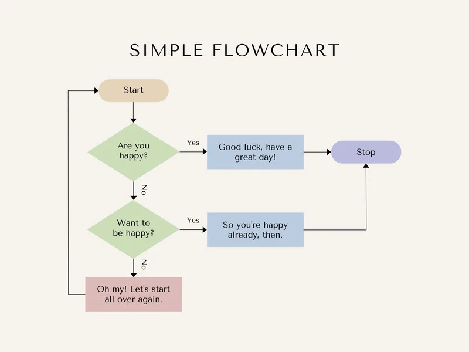

# FlowCraft - Flow Chart Generator

[](LICENSE)
[](https://www.linkedin.com/in/khajanbhatt/)

 <br>

<p style="font-size:16px;"> Hi, We are <B>CodeCrafters</B>. Welcome to the <B>FlowCraft - Flowchart Generator</B> - a project developed as part of the <B>"Hack The Spring - WeCode"</B> Hackathon in <B>GEHU</B>, created during my 2nd Year of B.Tech. C.S.E.</p> 

    Our Team includes:

          1. Deepak Singh Burathoki
          3. Vineet Pandey
          4. Khajan Bhatt
          5. Dhruv Rawat

## Table of Contents
- [Overview](#overview)
- [Features](#features)
- [Tech Stack](#tech-stack)
- [Directory Structure](#directory-structure)
- [Installation](#installation)
- [Usage](#usage)
- [Contributing](#contributing)
- [License](#license)
- [Acknowledgments](#acknowledgments)

## Overview
FlowCraft is a simple and intuitive flowchart maker that allows users to create, customize, and visualize flowcharts with ease. Built using HTML, CSS, and JavaScript for the frontend and powered by Python and JavaScript on the backend, FlowCraft is designed for students, educators, and professionals who need quick and clean diagramming tools right in their browser.

## Features
- 🎨 Drag-and-drop interface for adding flowchart shapes
- ✏️ Editable nodes (text, color, size)
- 🔗 Connectors between shapes to create meaningful flows
- 🧩 Customizable elements (arrows, boxes, etc.)
- 💾 Save and load flowchart data
- ⚙️ Lightweight backend support for processing and storing flowchart data

## Tech Stack

**1. Frontend**
- HTML5
- CSS3
- JavaScript

**2. Backend**
- **Python (Flask / FastAPI / SimpleHTTPServer)
- **Javascript

## Directory Structure
For detailed information about the project's structure, please refer to the [Directory Structure](directory_structure.md) document.

## Installation
To build and run the MerkelRex application, follow these steps:

1. Clone the repository:
   ```bash
   git clone https://github.com/Khajan38/Flowchart-Simulator
   ```
2. Install the tech-stacks from reqiurements.txt:
   ```bash
   pip install -r requirements.txt
   ```
3. Run the application:
   ```bash
   pyhton app.py
   index.html (Live Server)"
   ```

## Usage
- Start the web-application via app.py and index.html.
- Explore various tabs and features of the website.

## Contributing

Contributions are welcome! If you would like to contribute to the MerkelRex application, please follow these steps:

- Fork the repository.
- Create a new branch:
   ```bash
   git checkout -b feature/YourFeature
   ```
- Make your changes and commit them:
   ```bash
  git commit -m "Add your message"
  ```
- Push to your branch:
   ```bash
   git push origin feature/YourFeature
   ```
- Create a pull request.

## License
This project is licensed under the MIT License. See the [LICENSE](LICENSE) file for more details.

## Acknowledgments
Thank you for checking out the MerkelRex Application! We appreciate any feedback and contributions to enhance this project.